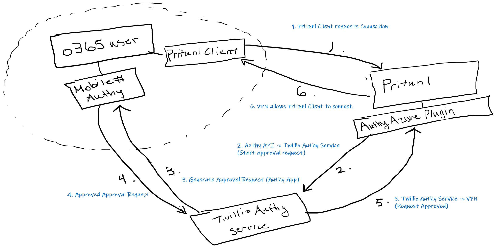

# Pritunl Azure Authy Plugin

## Use Case:
> You want to secure your Pritunl VPN using Twilio Authy as the 2FA provider

> All your VPN users are all part of an Office365 orginization

## Requirements:

> **Pritunl Azure SSO Login enabled**

> **Authy requires each user to have an E.164 compliant mobile phone number**

> **Each user in Office365 must have an E.164 compliant mobile phone number**

## Program Flow:

*Your users must log into the pritunl web portal using Azure SSO.* (This creates a new user in the Pritunl user DB with the correct user_name)

*Your users must use the profile generated from logging in through Azure SSO in their Pritunl Client/OpenVPN Client*

*This is needed as the user_name in pritunl must be their azure email address.* 

*This is the only way to retrieve the correct person's profile data from Microsoft Graph.*

## Install:

> Download the authy-azure-plugin.py and .env files to your pritunl plugin folder (/var/lib/pritunl/plugins/)

## Setup:

> **You will need to install a few python libraries: authy, phonenumbers, python-dotenv**

> Follow this link to install python libraries to pritunl https://docs.pritunl.com/docs/plugins#adding-python-libraries

> Modify the .env file with valid information

### Environment File:

`GROUP_BYPASS=<SPACE SEPERATED LIST OF PRITUNL GROUPS TO BYPASS AUTHY 2FA>`
> example: Group1 Group2 Group3 Group4

> Groups can be added to users manually in the Pritunl Admin UI

`GRAPH_SECRET=<MICROSOFT_GRAPH_APP_SECRET>`
`GRAPH_APP_ID=<MICROSOFT_GRAPH_APP_ID>`
`TENANT_ID=<MICROSOFT_GRAPH_TENANT_ID>`
> you will need to create an application in Azure https://portal.azure.com/ 

> the application permissions must have admin consent to read users' full profile (used to get the mobile phone number) as well as read directory data 

> Directory.Read.All and User.Read.All

`AUTHY_API=<AUTHY_API_KEY>`
> you will need to create an application in Twilio https://www.twilio.com/login

`AUTHY_ONETOUCH_LOGO_HIGH_RES=<URL OF A HIGH RES LOGO TO USE IN THE AUTHY ONE TOUCH REQUEST>`
> example: https://beta.cognitusconsulting.com/images/email/Cognitus256.gif  

`AUTHY_ONETOUCH_LOGO_LOW_RES=<URL OF A LOW RES LOGO TO USE IN THE AUTHY ONE TOUCH REQUEST>`
`AUTHY_ONETOUCH_MESSAGE=<AUTHY ONETOUCH MESSAGE TO ACCOMPANY THE LOGO>`
> example: VPN Login Requested

`MONGODB_HOST=<url of your pritunl mongodb db>`
`MONGODB_PORT=<port of your pritunl mongodb db>`
> normal installs of pritunl have defaults of localhost:27017

### Donations

> Show your appreciation. Buy me a coffee

